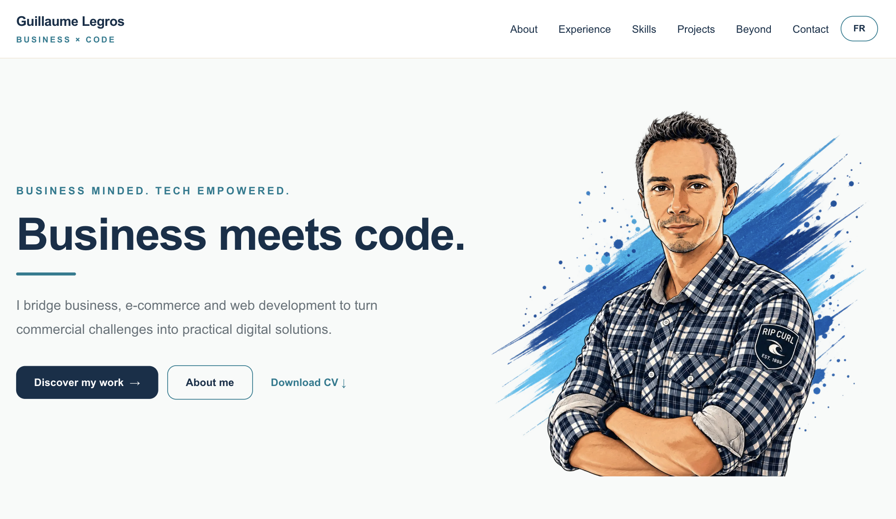
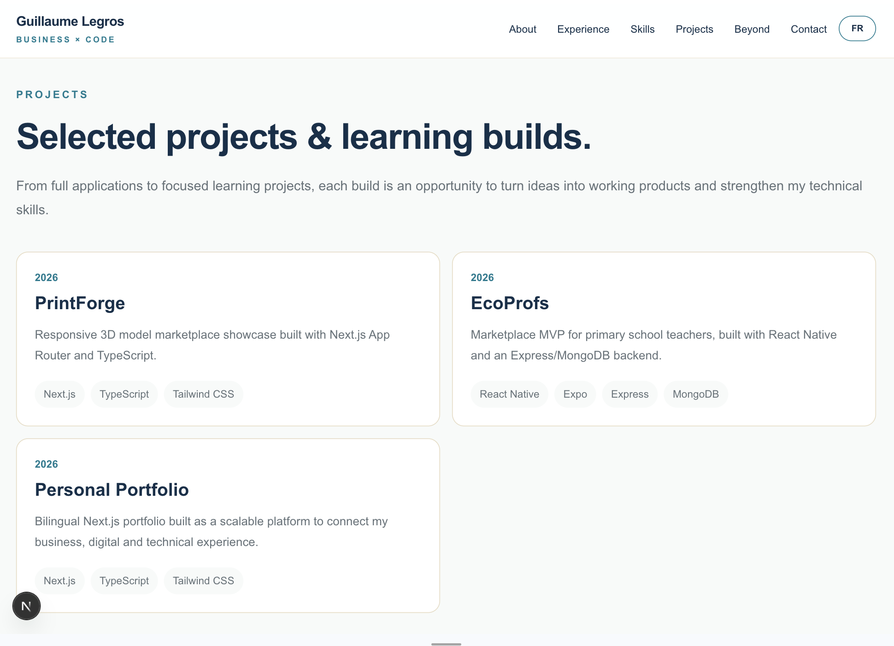
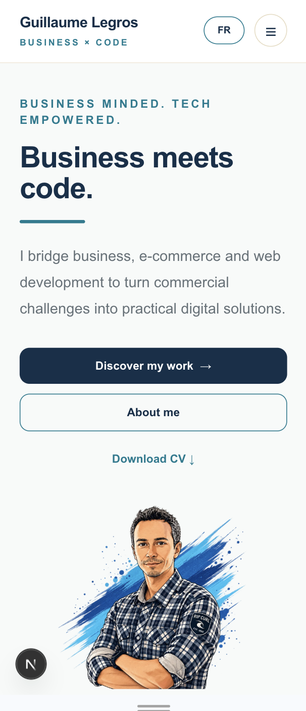

# Guillaume Legros — Personal Portfolio

A bilingual personal portfolio built with **Next.js, TypeScript and Tailwind CSS**, showcasing my background in **business development, e-commerce and digital marketing**, alongside my growing technical expertise in **web development**.

🌐 **Live portfolio:** https://guillaume-legros.vercel.app

---

## Overview

This portfolio was designed and developed as both a personal showcase and a hands-on web development project.

It reflects my hybrid **Business × Tech** profile, combining more than 15 years of experience across business development, e-commerce and digital marketing with technical skills developed through a Full-Stack JavaScript bootcamp and continued personal projects.

The website brings together:

- my professional career and detailed experience pages;
- selected web and mobile development projects;
- technical skills and technologies;
- downloadable French and English resumes;
- personal interests beyond work.

The project was built from scratch with a strong focus on **responsive design, reusable components, bilingual content, accessibility, navigation and SEO**.

---

### Preview

🌐 [View the live portfolio](https://guillaume-legros.vercel.app)

### Desktop



### Projects



### Mobile



---

## Key Features

- Fully responsive, mobile-first interface
- French and English versions
- Dynamic project pages
- Detailed professional experience pages
- Project galleries and external GitHub/demo links
- Downloadable FR / EN resumes
- Sticky navigation with active-section highlighting
- Responsive mobile navigation
- FR / EN language switch
- Dynamic SEO metadata
- Canonical URLs and language alternates
- Open Graph and social sharing metadata
- Dynamic sitemap and robots configuration
- Deployment on Vercel

---

## Tech Stack

### Frontend

- **Next.js 16**
- **React**
- **TypeScript**
- **Tailwind CSS**

### Next.js

- App Router
- Dynamic routes
- Server Components
- Client Components where required for interactivity
- Metadata API
- `next/image`
- `next/font`

### Development & Deployment

- Git / GitHub
- npm
- Vercel

---

## Project Structure

The project follows a modular structure that separates routing, UI components, content, types and shared utilities.

src/
├── app/
│   ├── [lang]/
│   │   ├── experience/
│   │   │   └── [slug]/
│   │   ├── projects/
│   │   │   └── [slug]/
│   │   └── page.tsx
│   ├── layout.tsx
│   ├── robots.ts
│   └── sitemap.ts
│
├── components/
│   ├── experience/
│   ├── layout/
│   ├── navigation/
│   ├── project/
│   └── sections/
│
├── data/
│   ├── experiences/
│   ├── home/
│   └── projects/
│
├── lib/
│
└── types/

### Architecture principles
- App Router handles routing and dynamic pages.
- Dynamic routes are used for project and professional experience pages.
- Reusable components keep page sections independent and maintainable.
- Content is separated from presentation through dedicated data files.
- TypeScript types provide consistent data structures across components.
- Locale-based content allows the same component architecture to serve both French and English versions.

For example, a project can be accessed through the same dynamic route structure in either language:

/en/projects/ecoprofs
/fr/projects/ecoprofs

The corresponding localized content is retrieved from the project data layer rather than duplicating the page components.

---

## Internationalization & SEO

The portfolio is available in both **English and French**, using locale-based routing while sharing the same component architecture.

### SEO

SEO is handled through the **Next.js Metadata API**.

The implementation includes:

- localized page titles and descriptions;
- dynamic metadata for project pages;
- dynamic metadata for professional experience pages;
- canonical URLs;
- French / English language alternates;
- Open Graph metadata for social sharing;
- Twitter / X card metadata;
- `robots.txt`;
- XML sitemap containing the main FR and EN routes.

### Internationalization

The language is handled directly through the URL structure:
/en
/fr


## Getting Started

To run the project locally:

### 1. Clone the repository

```bash
git clone https://github.com/Pikero-bx33/guillaume-portfolio.git
cd guillaume-portfolio
```

### 2. Install dependencies

```bash
npm install
```

### 3. Configure environment variables

Create a `.env.local` file at the root of the project:

```env
NEXT_PUBLIC_SITE_URL=http://localhost:3000
```

### 4. Start the development server

```bash
npm run dev
```

Open `http://localhost:3000` in your browser.

The root route automatically redirects to the English version of the portfolio:

```text
/en
```

The French version is available at:

```text
/fr
```

---

## Deployment

The portfolio is deployed on **Vercel**.

Production URL:

```text
https://guillaume-legros.vercel.app
```

Production deployments are automatically triggered when changes are pushed to the main GitHub branch.

---

## What I Learned

Building this portfolio allowed me to consolidate several aspects of modern frontend development beyond simply creating UI components.

In particular, the project helped me strengthen my understanding of:

- structuring a larger Next.js application with reusable components and separated data;
- working with the App Router and dynamic routes;
- using TypeScript to define and maintain consistent data structures;
- managing bilingual content without duplicating the UI architecture;
- designing responsive interfaces from mobile to desktop;
- handling navigation, scroll behavior and client-side interactions;
- implementing dynamic metadata, canonical URLs and multilingual SEO;
- organizing a project with maintainability and future evolution in mind;
- deploying and iterating on a production application with GitHub and Vercel.

It also reflects an important part of my learning approach: understanding not only how to build a feature, but how the different layers of a web application work together.

---

## Author

**Guillaume Legros**

Business Development · E-commerce · Digital Marketing · Web Development

🌐 [Portfolio](https://guillaume-legros.vercel.app)


